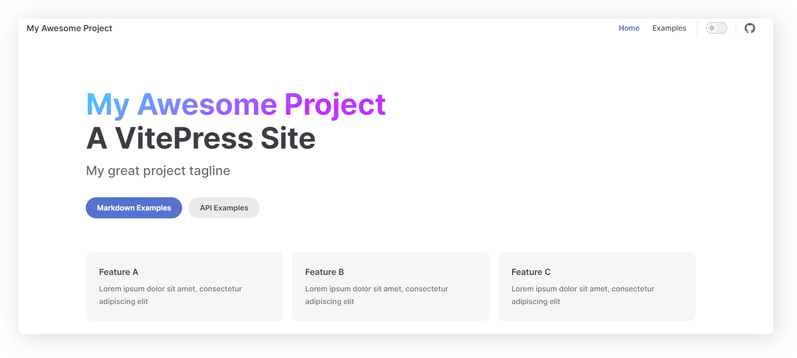
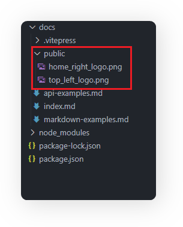
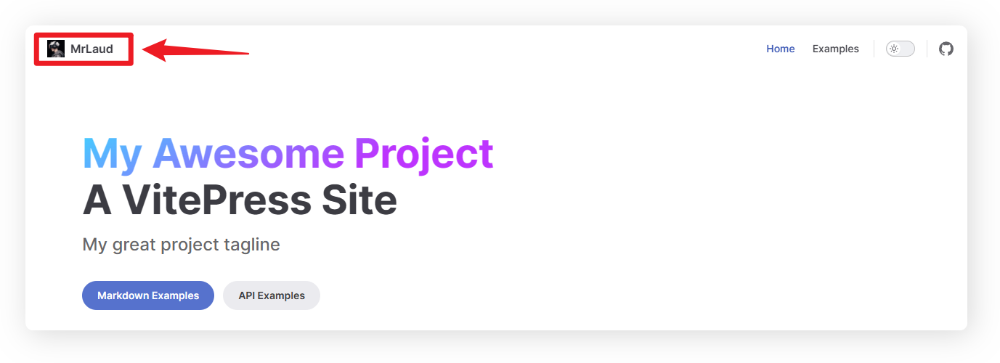
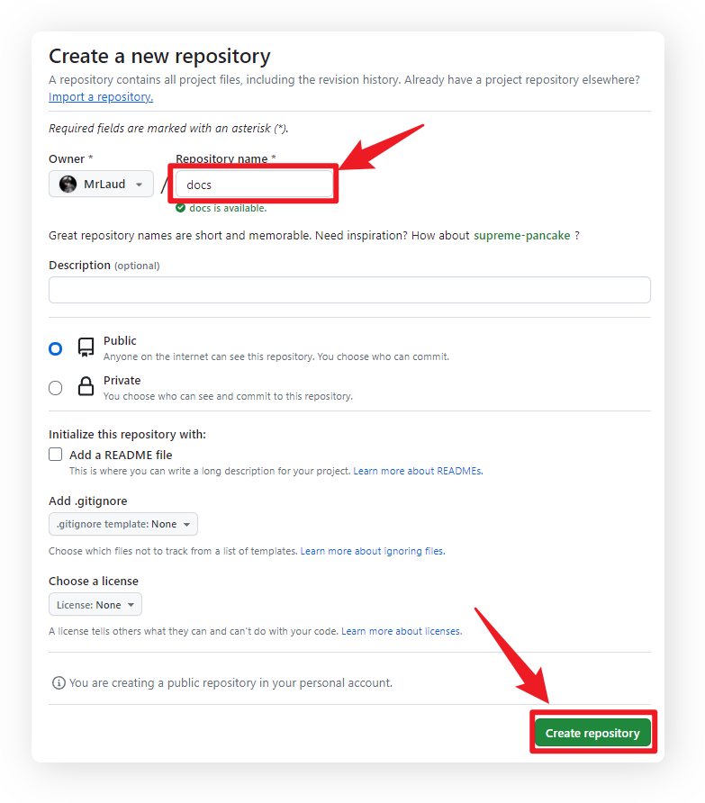

# vitepress 使用

官方文档：https://vitepress.dev/

#### 其他教程：

vitepress 从 0 到 1 :https://blog.csdn.net/weixin_44803753/article/details/130903396

## 快速搭建

首先创建并进入一个新目录：

```bash
mkdir vitepress-demo
cd vitepress-demo
```

::: details 如果没有安装过 pnpm，可以全局安装下

```
sudo npm install -g pnpm
```

:::

安装 vitepress

```bash
npm add -D vitepress
```

package.json 添加下面代码

```js{5-13}
{
    "devDependencies": {
        "vitepress": "^1.0.0-rc.20"
    },
    "type": "module",
    "pnpm": {
        "peerDependencyRules": {
        "ignoreMissing": [
            "@algolia/client-search",
            "search-insights"
        ]
        }
    }
}
```

初始化

```bash
pnpm dlx vitepress init
```

你会遇到几个简单的问题:

```bash
┌  Welcome to VitePress!
│
◇  Where should VitePress initialize the config?
│  ./docs
│
◇  Site title:
│  My Awesome Project
│
◇  Site description:
│  A VitePress Site
│
◇  Theme:
│  Default Theme + Customization
│
◇  Use TypeScript for config and theme files?
│  Yes
│
◇  Add VitePress npm scripts to package.json?
│  Yes
│
└  Done! Now run pnpm run docs:dev and start writing.
```

运行测试: `pnpm run docs:dev`


### 左上角 logo 和首页右侧 logo

docs 目录下创建 public
<br/>
准备 `top_left_logo.png` 100x100 像素 `home_right_logo.png` 200x200 像素 的两个 logo 放到`docs/public/`下



#### 右上角 logo 和名称自定义

修改 docs/.vitepress/config.ts 文件下的配置，具体代码为：

```js{2,4}
export default defineConfig({
  title: "MrLaud", // 标题
  themeConfig: {
    logo: "/top_left_logo.png", // 表示docs/public/top_left_logo.png
  },
});
```

效果：


#### 首页美化 home

首页部分的配置在 docs/index.md 文件，具体来看下面这些配置项：

```bash
---
# 提供三种布局，doc、page和home
# 官方文档相关配置：https://vitepress.dev/reference/default-theme-layout
layout: home
home: true

# 官方文档相关配置：https://vitepress.dev/reference/default-theme-home-page
title: 周一的博客
titleTemplate: Hi，终于等到你
editLink: true
lastUpdated: true

hero:
  name: MrLaud
  text: Stay foolish, Stay hungry.
  tagline: /斜杠青年/人间清醒/工具控/
  image:
    # 首页右边的图片  // 表示docs/public/top_left_logo.png
    src: /home_right_logo.png
    # 图片的描述
    alt: avatar
  # 按钮相关
  actions:
    - theme: brand
      text: 进入主页
      link: /markdown-examples
    - theme: alt
      text: 个人成长
      link: /api-examples
# 按钮下方的描述
features:
  - icon: 🤹
    title: Web前端
    details: 大厂程序媛，国内某互联网厂搬砖。
    link: /column/views/guide
  - icon: 🎨
    title: 喜欢美学
    details: 热爱一切美学，喜欢用各种设计工具造图。
  - icon: 🧩
    title: 斜杆青年
    details: 是个平平无奇但是又很热爱学习的斜杆青年。
---

```

效果：


## 部署 Github Pages

### 把项目提交到 Github 仓库

1.创建 Github 仓库


2.在根目录创建 .gitignore 忽略文件

```
node_modules
```

3. 在根目录创建 `deploy.sh` 文件（把项目推送到 github 并新增一个 gh-pages 分支）

```bash
# 确保脚本抛出遇到的错误
set -e

# 生成静态文件
yarn run docs:build

# 进入生成的文件夹
cd docs/.vitepress/dist

git init
git add -A
git commit -m 'deploy'

# git push -f <刚刚创建的github地址> master:gh-pages
git push -f https://github.com/MrLaud/docs.git master:gh-pages

cd -
```

4. package.json scripts 新增 deploy 命令

```json{2}
  "scripts": {
    "deploy": "deploy.sh",
    "docs:dev": "vitepress dev docs",
    "docs:build": "vitepress build docs",
    "docs:preview": "vitepress preview docs"
  }
```

5. config.ts 配置 base

在 .vitepress/config.ts 配置 base 为 Github 项目名

```bash{2}
export default defineConfig({
  base: '/docs/',
  title: "MrLaud",
  description: "A VitePress Site",
})
```

6. 把项目 push Github 上

```bash
# cd vitepress-demo
git init
git add .
git commit -m "first commit"
git branch -M main
git remote add origin https://github.com/MrLaud/docs.git
git push -u origin main
```

**部署 GitHub Pages**

```bash
pnpm run deploy
```


访问：https://mrlaud.github.io/docs/ 看效果

## 部署 Github Pages

参考：<br/>
https://blog.csdn.net/Dandrose/article/details/131201315
<br/>
https://agangdundan.cn/origin/
<br/>
https://juejin.cn/post/7147274707060916232?searchId=202309271624194D79DDE25F23810807E3#heading-9

### 创建 GitHub 项目


### 上传代码到 GitHub

**1. 创建 git 忽略文件**

在根目录创建 .gitignore

```
node_modules

```

**2. push Github 上**

```bash
# cd vitepress-demo
git init
git add .
git commit -m "first commit"
git branch -M main
git remote add origin https://github.com/MrLaud/vitepress-demo.git
git push -u origin main
```

#### 部署 github pages

在根目录创建 `deploy.sh` 文件（把项目推送到 github 并新增一个 gh-pages 分支）

```bash
# 确保脚本抛出遇到的错误
set -e

# 生成静态文件
yarn run docs:build

# 进入生成的文件夹
cd docs/.vitepress/dist

git init
git add -A
git commit -m 'deploy'

# git push -f <刚刚创建的github地址> master:gh-pages
git push -f https://github.com/MrLaud/vitepress-demo.git master:gh-pages

cd -
```

**以上操作完后再 push 代码**

```
git add .
git commit -m "部署"
git push
pnpm run deploy
```

**访问地址**
https://mrlaud.github.io/vitepress-demo/

```js
export default {
  data() {
    return {
      msg: "Highlighted!", // [!code  hl]
    };
  },
};
```
