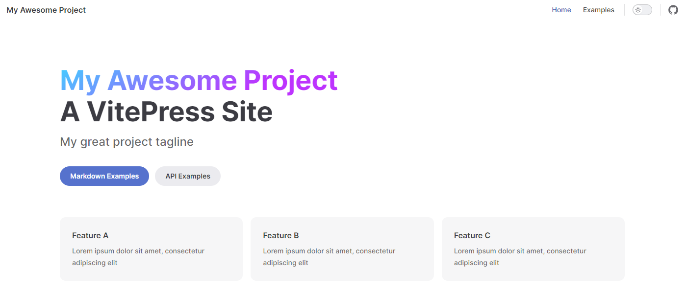

# vitepress 使用

官方文档：https://vitepress.dev/

#### 其他教程：

vitepress 从 0 到 1 :https://blog.csdn.net/weixin_44803753/article/details/130903396

## 快速搭建

首先创建并进入一个新目录：

```bash
mkdir vitepress-demo
cd vitepress-demo
```

::: details 如果没有安装过 pnpm，可以全局安装下

```
sudo npm install -g pnpm
```

:::

#### 安装 vitepress

```bash
npm add -D vitepress
```

package.json 添加下面代码

```js{5-13}
{
    "devDependencies": {
        "vitepress": "^1.0.0-rc.20"
    },
    "type": "module",
    "pnpm": {
        "peerDependencyRules": {
        "ignoreMissing": [
            "@algolia/client-search",
            "search-insights"
        ]
        }
    }
}
```

#### 初始化

```bash
pnpm dlx vitepress init
```

你会遇到几个简单的问题:

```bash
┌  Welcome to VitePress!
│
◇  Where should VitePress initialize the config?
│  ./docs
│
◇  Site title:
│  GiveAdmin
│
◇  Site description:
│  GiveAdmin Docs
│
◇  Theme:
│  Default Theme + Customization
│
◇  Use TypeScript for config and theme files?
│  Yes
│
◇  Add VitePress npm scripts to package.json?
│  Yes
│
└  Done! Now run pnpm run docs:dev and start writing.
```

#### 运行测试: `pnpm run docs:dev`



## 部署

### 创建 GitHub 项目

<!--  -->

### 上传代码到 GitHub

**1. 创建 git 忽略文件**

在根目录创建 .gitignore

```
node_modules

```

**2. push Github 上**

```bash
# cd vitepress-demo
git init
git add .
git commit -m "first commit"
git branch -M main
git remote add origin https://github.com/MrLaud/vitepress-demo.git
git push -u origin main
```

#### 部署 github pages

在根目录创建 `deploy.sh` 文件（把项目推送到 github 并新增一个 gh-pages 分支）

```bash
# 确保脚本抛出遇到的错误
set -e

# 生成静态文件
yarn run docs:build

# 进入生成的文件夹
cd docs/.vitepress/dist

git init
git add -A
git commit -m 'deploy'

# git push -f <刚刚创建的github地址> master:gh-pages
git push -f https://github.com/MrLaud/vitepress-demo.git master:gh-pages

cd -
```

**package.json scripts 新增 deploy 命令**

```json
"scripts": {
    "deploy": "deploy.sh",
}
```

**config.ts 配置 base**

在 .vitepress/config.ts 配置 base 为 Github 项目名

```bash
export default defineConfig({
    base: "vitepress-demo",
    title: "My Awesome Project"
})
```

**以上操作完后再 push 代码**

```
git add .
git commit -m "部署"
git push
pnpm run deploy
```

<!--  -->

**访问地址**
https://mrlaud.github.io/vitepress-demo/
